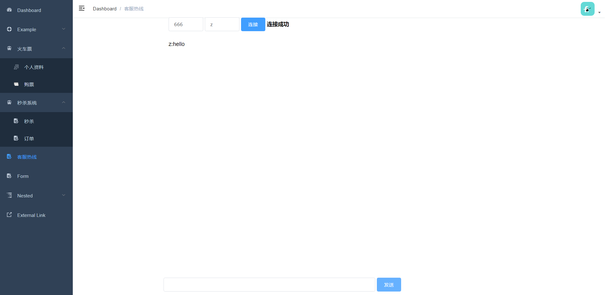

# 简介

基于SpringCloud开发的微服务项目。项目前后端分离，前端使用Vue，后端使用的技术和工具包括Spring、MySQL、MyBatis、Redis、Lua、RabbitMQ、Swagger、Nginx、Docker、OAuth2和JWT。实现的功能包括单点登录、权限管理、统一配置、高并发秒杀、接口文档。项目相对来说比较简洁，容易上手，结构完整，适合学习微服务架构。

# 功能预览

登陆

秒杀系统

抢购成功后

抢购成功的订单

WebSocket

# 快速开始

### 环境安装

建议先学习SpringBoot和SpringCloud相关基础知识

安装以下环境：

- git：版本管理
- nodejs：前端使用vue
- docker：以下组件都可在docker中安装，如果不熟悉docker可以自行在本地安装，建议使用，没用过的可以学习一下，非常非常非常方便
- nginx：负载均衡、代理解决跨域
- mysql：数据库
- redis：缓存
- rabbitmq：消息队列

### 启动

#### 1.先启动所有中间件

#### 2.创建数据库和表

#### 3.启动各个服务

有几个服务必须按照顺序启动，否则会报错：

- 服务注册中心-——eureka-server

- 配置中心——config-server

- OAuth2授权服务器

- zuul网关

其他服务顺序任意

#### 4.启动前端

前端并没有添加多少复杂的功能，一切从简

# 开发指南

## 项目目录结构

|——commons			  --通用模块

 		|——config	 	  --配置文件

 		|——utils			  --各种工具类

|——config-server	     --配置中心

|——eureka-server	    --服务注册中心

|——oauth-server	      --授权认证中心

|——seckill				    --秒杀系统

|——zuul					    --网关

## 基础服务

### 通用模块 - commons

这不是一个服务，是其他服务共用的一个模块，包括redis工具类、mysql代码生成、自定义请求和发送格式

### 服务注册中心 - eureka-server

使用Eureka作为服务中心

### 配置中心 - config-server

### 授权认证服务 - oauth-server

使用OAuth2实现SSO和权限管理

具体见：

### 网关 - zuul

提供统一入口，登陆校验，权限校验，负载均衡，熔断

### 秒杀系统 - seckill

使用mysql、redis+lua、rabbitmq逐步实现高并发秒杀

